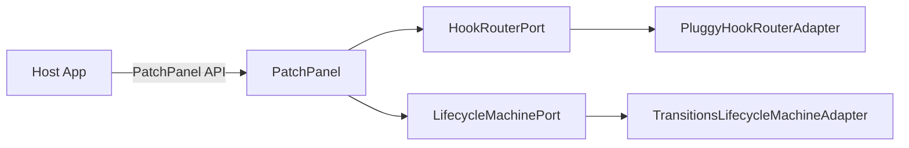
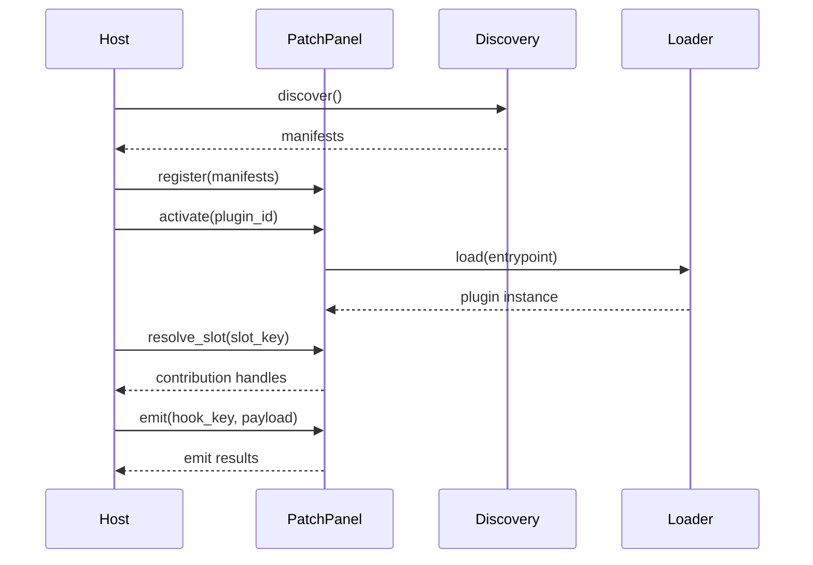

# Switchboard — V1 Architecture Spec
**Version:** 0.1 (Draft)  
**Status:** Proposed V1 Architecture  
**Date:** 2026-02-01  
**Project:** Switchboard (importable plugin runtime + registry)

---

## 0. Executive Summary

Switchboard is a **Python-first plugin runtime** designed to be embedded into other projects as a library. It provides:

- A **PatchPanel**: the central registry and resolution layer for plugin-provided contributions.
- **Slots**: named anchor points where UI or other contributions can be attached (e.g., “left-nav”, “settings-pane”, “task-list”).
- **Hooks**: named event interception points for lifecycle, command overrides, and event listeners.
- A **plugin lifecycle** with safe activation/deactivation and clear failure semantics.
- A clean **Ports & Adapters (Hexagonal)** boundary so consuming systems can integrate via stable interfaces while choosing their own I/O (CLI, HTTP, UI frameworks, etc.).

Switchboard is deliberately **consumer-agnostic**: it does not hard-code concepts from Continuum or SquadOps. Instead, it exposes a small, stable runtime contract that those systems can embed and extend.

---

## 1. Background & Problem Statement

Modern projects frequently need extension mechanisms for:
- UI panels/widgets
- command palettes / actions
- lifecycle triggers
- capability implementations
- event listeners / message handlers

Ad-hoc plugin systems tend to:
- couple plugins to internal modules
- make discovery/versioning brittle
- blur “registration” vs “execution”
- collapse failure boundaries (one bad plugin destabilizes the host)
- become untestable due to side effects during import time

**Switchboard** centralizes and formalizes the extension model so host systems can:
- define their own extension surface (“slots” + “hooks”)
- accept third-party or internal plugins consistently
- manage plugin lifecycle and failure boundaries
- build tooling (CLI, diagnostics, tests) around a stable core

---

## 2. Goals

### 2.1 Functional goals (V1)
1. **Importable library**: `pip install switchboard` and `from switchboard import PatchPanel`.
2. **Deterministic registration**: plugins register contributions without depending on import side-effects.
3. **PatchPanel registry**:
   - register/deregister plugins
   - resolve contributions for a slot/hook
   - query active/failed plugins
4. **Slots** for UI and non-UI contributions (not limited to UI).
5. **Hooks** for:
   - event listeners (pub/sub)
   - command interception / overrides
   - pre/post lifecycle observers
6. **Lifecycle**: `installed → ready → starting → active → stopping → ready` + `failed`.
7. **Compatibility and versioning**: clear semver boundaries for both Switchboard and plugin API compatibility.
8. **Observability**: structured logs + trace spans (host-provided adapters) for plugin activation and hook execution.
9. **Diagnostics**: a “doctor” report for plugin health, dependency, and contract failures.

### 2.2 Quality goals
- **Small core surface area**; avoid “framework sprawl.”
- **Host-controlled side effects**: plugin code should only run when activated or invoked.
- **Testability**: registry, resolution, and lifecycle are unit-testable without filesystem/entrypoint I/O.
- **Failure containment**: isolate failures by default at invocation boundaries, with consistent policies.

---

## 3. Non-Goals (V1)

1. A full remote marketplace, plugin store, or auto-update mechanism.
2. Perfect dependency isolation between plugins (e.g., per-plugin venv containers).
3. A full-blown UI composition framework (Switchboard only provides **slots** and **contributions**, not rendering).
4. Distributed plugin execution across multiple machines.
5. Sandboxing at OS-level (containers/VMs) as a hard requirement.

> V1 will be designed so these can be added later without breaking the core contract.

---

## 4. Terminology

- **Host**: an application embedding Switchboard.
- **PatchPanel**: the central registry + resolver + runtime coordinator.
- **Plugin Package**: the installable unit (pip package, local module, etc.).
- **Plugin Instance**: the runtime-loaded plugin object created by the loader.
- **Contribution**: an item a plugin provides to the host via Switchboard (UI panel, action, handler, adapter, etc.).
- **Slot**: a named anchor point for contributions (often UI, but not limited to UI).
- **Hook**: a named interception point for events/commands/lifecycle.
- **Manifest**: declarative metadata describing the plugin and what it contributes.
- **Capability** (host-defined): a stable interface/type a contribution implements.

---

## 5. High-Level Architecture

### 5.1 Component overview

- **Core (Domain)**
  - PatchPanel (aggregate root)
  - Plugin lifecycle state machine
  - Slot & Hook registries
  - Resolution engine
  - Failure policy

- **Application Layer**
  - Use cases: install/register, activate, deactivate, emit event, resolve slot, run command
  - Validation of manifests/contracts
  - Diagnostics report assembly

- **Adapters**
  - Discovery adapters: Python entry points, filesystem scanning, explicit list
  - Persistence adapters: in-memory, JSON index file
  - Observability adapters: logging, tracing
  - Execution adapters: in-process invocation (V1), optional subprocess runner (future)

### 5.2 Data flow summary
1. Host constructs `PatchPanel` with adapters and host-defined slot/hook definitions.
2. Host runs discovery to obtain plugin manifests and load targets.
3. Host registers plugins into PatchPanel (declarative first).
4. Host activates selected plugins; activation produces runtime plugin instances.
5. Host resolves contributions via `panel.resolve_slot(...)` or invokes hooks via `panel.emit(...)`.
6. PatchPanel enforces ordering, priority, policies, and failure handling.

### 5.3 “Slots + Hooks + PatchPanel” mental model
- **Slots** are “where things attach.”
- **Hooks** are “when things run” and “what can intercept.”
- **PatchPanel** is “the switchboard rack” that maps plugins → endpoints and orchestrates activation and routing.

---

## 6. Domain Model (DDD)

### 6.1 Aggregates & entities

#### PatchPanel (Aggregate Root)
**Responsibilities**
- Owns registry of plugins, slots, hooks, and contributions
- Validates registrations against declared contracts
- Orchestrates lifecycle transitions
- Resolves contributions for a slot/hook
- Applies ordering and conflict rules
- Records failures and health state

**Invariants**
- A plugin must be registered before activation.
- Contributions are only resolvable when plugin is `active` (or `ready` for purely declarative metadata queries).
- Slot/hook names are unique within a PatchPanel namespace.
- Version compatibility checks are enforced at registration or activation (host-configurable).

#### PluginPackage (Entity)
- `plugin_id`
- `distribution` (pip name / path)
- `version` (semver)
- `manifest` (immutable declarative metadata)
- `compatibility` (required switchboard API range, host API range)

#### PluginInstance (Entity)
- runtime object / module handle
- activation timestamp, state
- runtime resources (optional handles)
- error info if failed

#### Contribution (Entity)
- `contribution_id`
- `plugin_id`
- `slot_key` OR `hook_key`
- `contribution_type` (host-defined)
- `priority`
- `constraints` (optional: role-based visibility, feature flags, context filters)
- `factory_ref` (how to construct or invoke the contribution)

#### SlotDefinition (Entity)
- `slot_key`
- `description`
- `schema` (optional JSON-schema-like contract describing expected props)
- `constraints` (host-defined policy; e.g., max one contribution, allow many, allow override)

#### HookDefinition (Entity)
- `hook_key`
- `kind`: `event` | `command` | `lifecycle`
- `signature` (expected payload type)
- `policy` (ordering, cancellation, conflict rules)

### 6.2 Value objects
- `PluginId` (string, stable)
- `SemVer` (major.minor.patch)
- `SlotKey`, `HookKey` (namespaced strings, e.g., `ui.left_nav`)
- `ContributionId` (uuid-ish or `{plugin_id}:{local_name}`)
- `ApiRange` (e.g., `>=0.1,<0.2`)
- `FailureRecord` (time, location, exception class, message, stack digest)

### 6.3 Domain events (internal)
- `PluginRegistered`
- `PluginActivated`
- `PluginDeactivated`
- `PluginFailed`
- `ContributionRegistered`
- `ContributionInvoked`
- `HookEmitted`

These events are primarily for diagnostics/telemetry and optional host observers.

---

## 7. Lifecycle Model

### 7.1 States
- **installed**: package exists (discovered), not registered in PatchPanel
- **ready**: registered + validated, not running
- **starting**: activation in progress
- **active**: running and contributions invokable
- **stopping**: deactivation in progress
- **failed**: activation failed or runtime faults crossed policy thresholds
- **removed**: unregistered and detached

### 7.2 Transitions
- `install/discover → register → activate → deactivate → remove`
- Failures can move:
  - `starting → failed`
  - `active → failed` (if policy escalates runtime errors)

### 7.3 Failure policies (host-configurable)
- **fail-open** (default for non-critical hooks): log error, continue
- **fail-closed** (default for critical command overrides): abort operation
- **trip-breaker**: after N failures in window, mark plugin as failed and disable it
- **quarantine**: disable only a specific hook/contribution while leaving plugin active (future; V1 optional)

---

## 8. Contracts & Manifests

### 8.1 Plugin Manifest (required)
A plugin ships a declarative manifest that Switchboard can load **without executing plugin runtime code**.

**Manifest fields (V1)**
- `plugin_id` (stable, reverse-DNS recommended)
- `name`
- `version`
- `description`
- `author` (optional)
- `license` (optional)
- `switchboard_api` (required range)
- `host_apis` (optional: one or more host-defined API ranges)
- `entrypoint` (where to load the plugin runtime instance)
- `contributions` (slots/hooks)
- `dependencies` (optional metadata: pip deps, optional features)
- `capabilities` (optional: tags/categories for discovery)

### 8.2 Example manifest (YAML)
```yaml
plugin_id: "com.backspring.example.todo"
name: "Todo Panel"
version: "1.2.0"
description: "Adds a todo UI panel and a command."
switchboard_api: ">=0.1,<0.2"
entrypoint: "todo_plugin:TodoPlugin"
contributions:
  slots:
    - id: "todo.panel"
slot: "ui.right_pane"
      type: "ui.panel"
      priority: 50
      factory: "todo_plugin:build_panel"
  hooks:
    - id: "todo.command"
      hook: "command.palette"
      kind: "command"
      priority: 60
      handler: "todo_plugin:command_handler"
```

### 8.3 Contract validation
At registration time PatchPanel validates:
- manifest schema correctness
- referenced slots/hooks exist (or are declared as “dynamic” per host policy)
- API range compatibility
- contribution uniqueness rules per slot/hook policy
- handler/factory references are syntactically resolvable (optionally deferred to activation)

At activation time PatchPanel validates:
- entrypoint importable
- plugin instance implements expected interface (if host specifies one)
- factories/handlers callable with expected signature (best-effort)

---

## 9. Resolution & Routing

### 9.1 Slot resolution
`resolve_slot(slot_key, context) -> list[ContributionHandle]`

Ordering:
1. higher `priority` first
2. then deterministic tie-break: `plugin_id`, `contribution_id`

Slot policies (host-defined):
- **multi** (default): many contributions allowed
- **single**: only one contribution allowed; choose highest priority
- **override**: allow “replacement” of existing contribution if higher priority and `override=true`

Context filtering:
- Contribution constraints can include:
  - `roles`: allowed user roles
  - `features`: required feature flags
  - `predicates`: host-provided predicate keys (evaluated by host adapter)

### 9.2 Hook routing
Hooks support 3 common patterns:

1. **Event** (pub/sub):
   - All handlers are called (unless cancelled).
2. **Command** (override / chain):
   - “first match wins” or “chain of responsibility” (host policy).
3. **Lifecycle**:
   - Observers are called at activation/deactivation boundaries.

Cancellation:
- A handler may return `Cancel()` or raise `CancelHook` to stop propagation (per hook policy).

---

## 10. Hexagonal Architecture (Ports & Adapters)

### 10.1 Inbound ports (host → Switchboard)
- `RegistryPort`
  - `register(manifest)`
  - `unregister(plugin_id)`
  - `list_plugins()`
- `LifecyclePort`
  - `activate(plugin_id)`
  - `deactivate(plugin_id)`
- `ResolutionPort`
  - `resolve_slot(slot_key, context)`
  - `resolve_hook(hook_key, context)`
- `EventPort`
  - `emit(hook_key, payload, context)`
  - `invoke(contribution_handle, input, context)`
- `DiagnosticsPort`
  - `doctor() -> Report`

### 10.2 Outbound ports (Switchboard → infrastructure)
- `DiscoveryAdapter`
  - yields `PluginPackage` / manifest descriptors
- `LoaderAdapter`
  - loads plugin instance, factories, handlers
- `PersistenceAdapter`
  - store/read registry state (optional)
- `ClockAdapter`
  - timestamps
- `LoggerAdapter`
  - structured logs
- `TracerAdapter`
  - spans/events
- `PolicyAdapter`
  - host policy decisions (failure, conflict, filtering)

---

## 11. Public Python API (V1)

### 11.1 Core types
- `PatchPanel`
- `PluginManifest`
- `SlotDefinition`, `HookDefinition`
- `ContributionHandle`
- `ActivationResult`, `DiagnosticsReport`

### 11.2 Suggested top-level API
```python
from switchboard import PatchPanel, SlotDefinition, HookDefinition
from switchboard.adapters import EntryPointDiscovery, ImportLoader

panel = PatchPanel(
    slots=[
        SlotDefinition("ui.left_nav", policy="multi"),
        SlotDefinition("ui.right_pane", policy="single"),
    ],
    hooks=[
        HookDefinition("command.palette", kind="command", policy="first_match"),
        HookDefinition("app.started", kind="lifecycle", policy="broadcast"),
    ],
    discovery=EntryPointDiscovery(group="myhost.plugins"),
    loader=ImportLoader(),
)

panel.discover_and_register()
panel.activate_all()

widgets = panel.resolve_slot("ui.left_nav", context={"role": "admin"})
panel.emit("app.started", payload={"ts": 123}, context={})
```

### 11.3 Contribution invocation contract
A `ContributionHandle` is a small wrapper that:
- references the plugin + contribution id
- exposes `invoke(...)` that applies policies and collects telemetry
- can be converted to a host-specific object (e.g., a UI component) via adapters

---

## 12. Discovery & Loading

### 12.1 Discovery mechanisms (V1)
1. **Python entry points** (recommended)
2. **Explicit list** (host passes manifests)
3. **Filesystem scan** (optional)

### 12.2 Loading strategy
- **Registration** uses manifest only.
- **Activation** loads runtime plugin instance from `entrypoint`.
- Contribution factories/handlers are resolved lazily on first use by default (host-configurable).

### 12.3 Import side effects rule
Plugins should **not** execute significant logic on import. Switchboard should:
- discourage import-time registration
- prefer manifest-driven registration
- provide `Plugin.activate(context)` hook where side effects may occur

---

---

## 12A. Reference Implementation Dependencies (V1)

Switchboard’s **public architecture contract** is defined by its domain model (PatchPanel, Slots, Hooks, Manifests, Lifecycle) and its Ports & Adapters boundaries. The following libraries are recommended for the **reference implementation** because they map cleanly to the model, improve correctness, and reduce bespoke code — **but they are not part of the public API contract** and must not “leak” into plugin or host-facing types.


### 12A.0 Dependency commitment (V1)

Switchboard V1 **intentionally depends on** the following libraries to avoid re-implementing mature, well-tested primitives:

- **Pluggy** for hook dispatch semantics (ordering, multi-cast, first-result patterns)
- **Transitions** for lifecycle state machine correctness (explicit states, guarded transitions, callbacks)

These are **first-class internal dependencies** in V1 (not “nice-to-have extras”). The architectural rule is:

- **Commit internally, abstract externally:** Switchboard commits to these engines for correctness and velocity, while keeping the **public contract** (manifests + PatchPanel API + domain types) **Switchboard-native** so hosts/plugins never take a direct dependency on Pluggy/Transitions concepts.

Replacement later is possible *only* behind the same ports and should be treated as a major refactor with strong compatibility tests — not a casual swap.

#### Internal seam (ports → adapters)



### 12A.1 Pluggy (hook routing engine)

**Role in Switchboard:** Implements the *dispatch mechanics* for Hooks (ordering, multi-cast, first-result/command patterns), while Switchboard remains the source of truth for:
- plugin registration state (ready/active/failed)
- manifest validation
- contribution metadata (priority, constraints, policies)
- failure policies and telemetry

**Mapping**
- Switchboard `HookDefinition` → Pluggy *hookspec* (generated/registered by a HookRouterAdapter)
- Switchboard hook contributions (`handler` refs) → Pluggy *hookimpls*
- Switchboard hook policies:
  - `broadcast` → normal Pluggy multi-call
  - `first_match` / `first_result` → Pluggy `firstresult=True` style
  - `chain` → ordered calls with explicit propagation rules (implemented in router adapter)

**Implementation constraint (important):**
- No Pluggy objects/types appear in Switchboard’s public API.
- Pluggy is used behind an internal `HookRouterPort` with a `PluggyHookRouterAdapter` reference implementation.

### 12A.2 Transitions (plugin lifecycle state machine)

**Role in Switchboard:** Implements the plugin lifecycle state machine so transitions are explicit, testable, and auditable.

**Mapping**
- Switchboard plugin states:
  - `installed → ready → starting → active → stopping → ready` plus `failed`
- Switchboard lifecycle operations (`activate`, `deactivate`) → guarded transitions
- Switchboard lifecycle hooks (optional) → `on_enter_*` callbacks (e.g., `on_enter_active` emits `plugin.activated` hook)

**Implementation constraint (important):**
- Transitions is used behind an internal `LifecycleMachinePort` with a `TransitionsLifecycleMachineAdapter` reference implementation.
- Lifecycle events emitted to hosts are Switchboard domain events/hooks, not Transitions callbacks.

### 12A.3 Why include these details in the spec?

This spec includes these selections so implementers (and code assistants) can:
- build a consistent V1 quickly with fewer design ambiguities
- align internal structure to the domain model (Ports & Adapters)
- keep the public contract stable even if internal libraries change later

---


## 13. Security & Safety

### 13.1 Baseline V1 safety
- Allowlist-based file access for plugin resources (host policy)
- Limit what is passed in `context` (host responsibility)
- Clear boundaries for critical hooks:
  - command overrides default to fail-closed
  - non-critical events default to fail-open

### 13.2 Optional hardening paths (future)
- subprocess runner (plugin execution out-of-process)
- plugin signing and verification
- per-plugin virtual environments or container sandboxes

---

## 14. Observability & Diagnostics

### 14.1 Telemetry events
- plugin registration
- activation/deactivation duration
- hook emit duration and handler outcomes
- contribution invocation duration and failures

### 14.2 “Doctor” report content
- Switchboard version
- discovered plugins
- registered plugins + states
- compatibility mismatches
- missing slots/hooks referenced by contributions
- failure records and stack digests
- policy configuration summary

---

## 15. Persistence

V1 persistence is optional. The simplest V1 approach:
- in-memory PatchPanel for runtime
- optional JSON “registry snapshot” file for warm-start

Persistence fields:
- plugin state
- last activation timestamp
- failure counters
- pinned enable/disable flags

---

## 16. Concurrency & Performance

- PatchPanel operations are thread-safe via a single internal lock or RW lock.
- Hook emission can be:
  - synchronous (default V1)
  - async (optional if host provides async adapter)
- Hot paths:
  - slot resolution (cacheable per context key)
  - hook handler list resolution (cacheable)
- Caches must invalidate on:
  - plugin activation/deactivation
  - registration changes
  - policy changes

---

## 17. Integration Patterns for Consuming Systems

### 17.1 General guidance
A host system should:
1. Define slots and hooks as part of its own “host extension surface.”
2. Provide policies (conflict rules, failure handling).
3. Map contributions to host constructs:
   - UI widget/components
   - commands/actions
   - handlers/services

### 17.2 Example: UI host (e.g., a dashboard app)
- define slot keys for each UI slot
- allow multiple contributions in navigation slots, single contribution in main pane
- map `ui.panel` contributions to actual UI component factories

### 17.3 Example: a workflow/task system
- define hooks like `task.created`, `task.started`, `task.completed`
- define slots for “capability providers” or “task pack providers”
- map contributions to callable services

> This section intentionally describes patterns without naming specific host products.

---

---

## 17A. UI Slots for Front-End Frameworks (Svelte/React/etc.)

Switchboard supports UI extensibility by treating UI as **data + contracts**, not as a rendering framework. Switchboard’s job is to:
- **register** UI contributions (via manifests)
- **resolve** contributions for a given UI slot (ordering/policies)
- **apply** failure/diagnostics policies at invocation boundaries (when applicable)

The host application’s job is to:
- **load** the front-end module (bundler/runtime decision)
- **mount** the module into a DOM/native container
- **validate** props and apply UI security policies (CSP/allowlists/signing)

### 17A.1 UI contribution types (framework-neutral)

V1 introduces a framework-neutral UI contribution descriptor. Recommended contribution type:

- `type: "ui.module"`

A `ui.module` contribution is a **descriptor** that tells the host *what to mount* and *how to treat it* — without Switchboard needing to know Svelte, React, or any other UI runtime.

**Recommended descriptor shape (V1)**
- `ui.kind`: `"svelte"` | `"react"` | `"web_component"` | `"native"` | `"unknown"`
- `ui.module`: module/package identifier (e.g., npm package name, module federation key, import-map name)
- `ui.export`: export name to mount (often `"default"`)
- `ui.assets`: optional asset references (CSS, icons, preloads)
- `ui.props_schema`: optional JSON schema for props validation
- `ui.route`: optional route/placement metadata (host-owned)
- `ui.permissions`: optional host-defined permission/feature flags

**Manifest example (Svelte module)**
```yaml
contributions:
  slots:
    - id: "todo.panel"
      slot: "ui.right_pane"
      type: "ui.module"
      priority: 50
      ui:
        kind: "svelte"
        module: "@acme/todo-panel"
        export: "default"
        props_schema: "schemas/todo_panel_props.json"
        route: "/todo"
```

### 17A.2 Slot metadata for UI composition (host-defined)

Hosts may optionally annotate UI slots with presentation/mount metadata to make composition rules explicit:

- `presentation.mode`: `single` | `tabs` | `stack` | `replace` | `modal` | `drawer`
- `mount_contract`: what the host will provide (e.g., `dom_node`, `props`, `unmount`)

Example (host-side):
```python
SlotDefinition(
  "ui.right_pane",
  policy="single",
  presentation={"mode": "tabs", "mount_contract": "dom_node"}
)
```

### 17A.3 Adapter seam: UI surface mounting (host responsibility)

If you want a clean Hex boundary for UI mounting, define an outbound adapter used by the host integration layer:

- `UiSurfacePort.mount(ui_descriptor, mount_target, props) -> MountedHandle`
- `MountedHandle.unmount()`

Switchboard does **not** implement UI mounting; it only resolves `ui.module` descriptors. The host chooses:
- bundler strategy (vite/webpack/rollup, etc.)
- module loading model (import maps, module federation, local bundles)
- security controls (allowlists, signing, CSP)

---


---

## 17B. Agent Task Packs and Loadouts (non-UI Slots)

Slots are intentionally **not UI-specific**. In V1, hosts can define non-UI slots that accept contributions such as:
- **Task Packs**: declarative task templates / DAG expansion providers
- **Agent Loadouts**: capability bundles, tool sets, policy packs, and configuration profiles

This enables “plugin packs” that can be discovered, selected, and applied without coupling Switchboard to any single host domain.

### 17B.1 Recommended non-UI slot conventions

Use namespaced slot keys to keep intent clear:

- `ui.*` → UI placement slots
- `packs.task` → task pack catalog slot
- `packs.loadout` → agent loadout catalog slot
- `providers.*` → implementation/provider slots (host-defined)

### 17B.2 Task Pack contribution model

Recommended contribution type:

- `type: "agent.task_pack"`

A task pack contribution should be a **provider descriptor + factory reference** (host-defined interface). Common patterns:
- `factory` returns an object with `metadata` and `expand(work_order) -> list[TaskSpec]`
- or `handler` participates in a `workload.expand` hook (see 17B.4)

**Manifest example (task pack provider)**
```yaml
contributions:
  slots:
    - id: "crysis.core_pack"
      slot: "packs.task"
      type: "agent.task_pack"
      priority: 50
      factory: "crysis_pack:build_task_pack"
      tags: ["crysis", "baseline", "python"]
```

### 17B.3 Agent Loadout contribution model

Recommended contribution type:

- `type: "agent.loadout"`

A loadout is typically a declarative bundle describing:
- enabled capabilities
- tool allowlists
- policy presets (failure policy, escalation thresholds)
- resource hints (model class, runtime limits)
- environment/config overlays

**Manifest example (agent loadout)**
```yaml
contributions:
  slots:
    - id: "neo.dev.loadout"
      slot: "packs.loadout"
      type: "agent.loadout"
      priority: 60
      factory: "neo_loadout:build_loadout"
      tags: ["dev", "python", "squad"]
```

### 17B.4 Optional hook integration for dynamic composition

Some hosts will want packs to inject tasks dynamically. Switchboard supports this via hooks without owning the host domain:

- hook: `workload.expand` (kind: command/chain or event/broadcast)
- hook: `plan.enrich` (kind: event)

**Manifest example (workload expansion hook)**
```yaml
contributions:
  hooks:
    - id: "crysis.expand"
      hook: "workload.expand"
      kind: "command"
      priority: 55
      handler: "crysis_pack:expand_workload"
```

Policy guidance:
- Use `broadcast` when multiple packs add tasks cumulatively.
- Use `first_match`/`first_result` when you want “best provider wins.”
- Use `chain` when you want ordered enrichment with explicit propagation rules.

---


## 18. Repository / Package Structure (proposed)

```
switchboard/
  __init__.py
  domain/
    patch_panel.py
    lifecycle.py
    models.py
    policies.py
    errors.py
  application/
    register.py
    activate.py
    resolve.py
    emit.py
    diagnostics.py
  adapters/
    discovery/
      entrypoints.py
      filesystem.py
    loader/
      import_loader.py
    persistence/
      memory.py
      json_snapshot.py
    observability/
      logging.py
      tracing.py
  schemas/
    plugin_manifest.json
  cli/
    main.py
  tests/
    unit/
    integration/
```

---

## 19. Testing Strategy

### 19.1 Unit tests
- manifest validation
- slot/hook resolution ordering
- lifecycle transitions
- failure policy behavior

### 19.2 Integration tests
- discovery adapter + loader adapter
- activation + hook emission end-to-end
- diagnostics “doctor” output

### 19.3 Host contract tests (recommended)
A host should publish “extension surface contract tests” that:
- assert required slots/hooks exist
- assert contribution types validate
- run a golden set of reference plugins

---

## 20. Versioning & Compatibility

- Switchboard follows semver.
- Plugin manifests declare `switchboard_api` range.
- Hosts may define their own host API ranges (optional).
- Compatibility checks happen at registration or activation.

Recommended policy:
- **strict for major changes**
- **warn for minor mismatches**
- **allow override for dev builds**

---

## 21. Future Extensions (post-V1)

1. Hot reload / live plugin toggling (with safe state handoff)
2. Subprocess plugin runner (stronger isolation)
3. Signed plugins + trust policies
4. Remote plugin catalogs
5. UI contribution types for web/mobile packaging (still host-owned)
6. Rich conflict resolution (e.g., multiple command providers with ranking rules)

---

## Appendix A — Minimal Plugin Runtime Interface

A plugin entrypoint should yield an object like:

```python
class SwitchboardPlugin:
    def activate(self, context: dict) -> None:
        ...

    def deactivate(self, context: dict) -> None:
        ...
```

Contributions should use factories/handlers referenced by manifest rather than import-time mutation of PatchPanel.

---

## Appendix B — CLI (optional V1)

- `switchboard list`
- `switchboard activate <plugin_id>`
- `switchboard deactivate <plugin_id>`
- `switchboard doctor`
- `switchboard dump-registry`

CLI is purely an adapter over PatchPanel ports.

---

## Appendix C — Mermaid: Core flow


